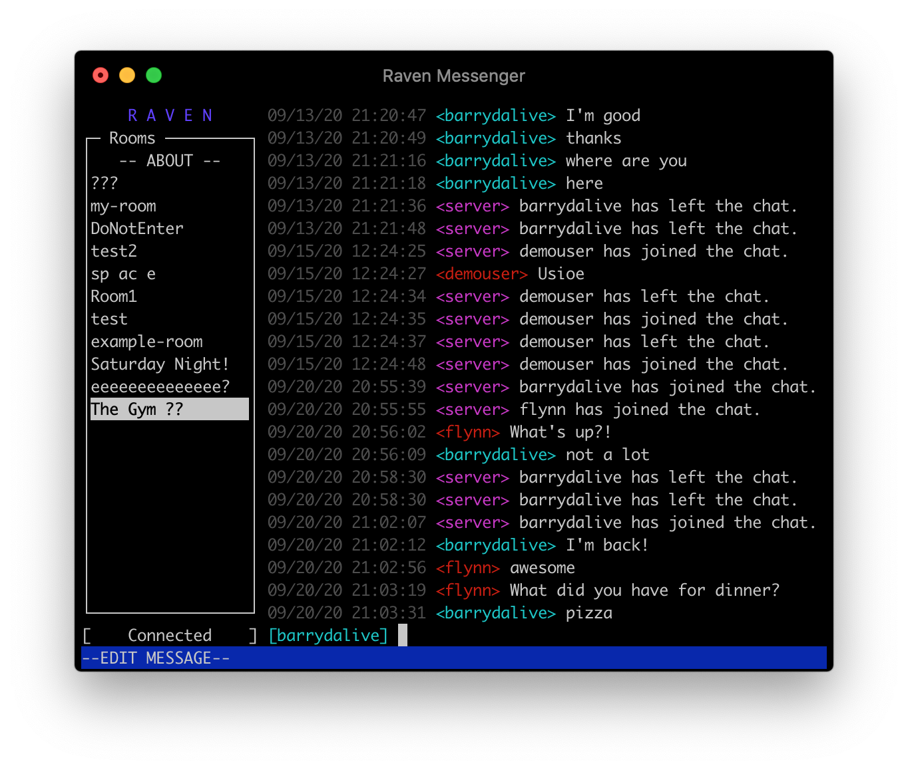

# Raven CLI
**See Also:** &nbsp;&nbsp;&nbsp;&nbsp;🏗 [AWS Infrastructure](https://github.com/barrymcandrews/raven-iac)&nbsp;&nbsp;&nbsp;&nbsp;&bull;&nbsp;&nbsp;&nbsp;&nbsp;🖼️ [React Frontend](https://github.com/barrymcandrews/raven-react)&nbsp;&nbsp;&nbsp;&nbsp;&bull;&nbsp;&nbsp;&nbsp;&nbsp; 🚀[React Frontend Demo](https://raven.bmcandrews.com)


## About The Project
Raven Messenger is a proof-of-concept serverless chat application. This project provides a way to consume the Raven Web APIs from the command line.

### Text-based User Interface (TUI)



The text-based user interface lets you browse and send messages like you would in a web browser. 

### Command Line Interface (CLI) 
*_Under Construction_ *

The goal of the CLI is to provide programmatic access to Raven's messages and rooms. This is geared towards making it easier to integrate a chatbot into the platform.
 
## Getting Started
Before using this project you'll need to create an account using the [React Frontend](https://github.com/barrymcandrews/raven-react). 
<!--
### Installation

Install the application by using the node package manager of your choice:

```
$ npm install -g @bmcandrews/raven-cli
```

Once installed, start the TUI by running the `raven` command:  

```
$ raven
```
-->
### Building from Source

To set up the project, clone the repository and install the dependencies.


```
$ git clone https://github.com/barrymcandrews/raven-cli
$ cd raven-cli
$ yarn install
```

#### Usage

 * `yarn run build`  compile TypeScript to JavaScript
 * `yarn run start`  run the app in development mode
 * `yarn run local`  install the app globally, then run the app


## Contact

Barry McAndrews - bmcandrews@pitt.edu

Project Link: [https://github.com/barrymcandrews/raven-cli](https://github.com/barrymcandrews/raven-cli)
